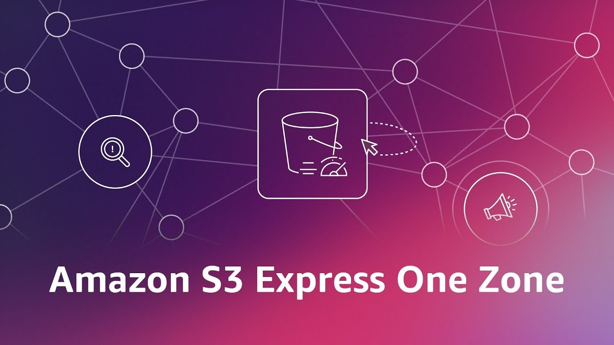

At this year's re:invent conference, AWS announced a new storage class, S3 Express One Zone (S3 EOZ), that offers single-digit millisecond latency, an up to 100x improvement over S3 Standard, which leaves us wondering if this could disrupt database design in the cloud we know today.

# State of the Art

Snowflake pioneered the decoupling of compute and storage for analytical query processing and set the industry standard to use blob storage like S3 as the storage layer. To achieve low query latency, Data Warehouses usually implement a caching mechanism on top of S3 to store hot data on local SSDs of compute nodes.

At this year's VLDB conference, Dominik Durner from the Database Group at the Technical University of Munich published a paper introducing AnyBlob, a download manager for query engines that maximizes throughput while minimizing CPU usage. Dominik showed how the database system Umbra, with local caching disabled, outperformed existing Data Warehouses using SSD caches. AnyBlob makes a strong case for increasing elasticity for analytical query processing by removing SSD caches. This allows you to spin up a new EC2 instance and query data blazingly fast without warming up the cache beforehand.

All Experiments in the paper were conducted on S3 Standard. If we believe AWS's promises that S3 EOZ can deliver <10 ms latency, it would mean we could not only run analytical workloads purely on S3 as a storage layer but potentially also transactional workloads. The elephant in the room is the cost of using S3 EOZ instead of S3 Standard.

# S3 EOZ Cost Calculations

The limiting factor of replacing local caches with S3 is the access cost. As mentioned in the announcement introducing S3 EOZ, the request costs were reduced by 50%, which sparks hope at first, but if you give the pricing model a closer look, you will quickly find that besides the request costs, AWS is charging an additional fee for large request sizes. For data transferred of request sizes greater than 512 KiB, an additional $0.008/GiB for PUTs and $0.0015/GiB GETs is charged.

One option would be to decrease the request size below the 512 KiB mark. It is unclear if, with such a small request size, S3 bandwidth can be saturated. The AnyBlob paper showed that for S3 Standard, a request size between 8 and 16 MiB is needed to utilize the full network bandwidth.

Using the same configurations on S3 EOZ, as Dominik suggested for S3 Standard, would significantly increase the total access cost. One would have to pay $1.5/TiB for 90\%  [(8 MiB - 512 KiB) / 8 MiB] of all data retrieved from S3. Running the TPC-H SF-500 Benchmark on S3 EOZ would cost almost $ 1.5 compared to $ 0.2 for S3 Standard. The additional charge for data transfer would dominate both the S3 request cost and the EC2 instance cost of less than $ 0.2. This should be avoided to keep the cost of query processing on S3 predictable.

# What's next?

So does this mean that all hope of affordable query processing on S3 EOZ is lost? No - at least not yet. We have some unanswered questions that need positive results to make S3 EOZ useful for fast query processing. First and foremost is whether the 100 Gbit/s network bandwidth of S3 EOZ can be saturated with an object size of less than 512 KiB. If not, the additional charge would make replacing S3 Standard with S3 EOZ economically infeasible. Furthermore, the lower latency may indicate that S3 EOZ could be useful for transactional workloads, but exactly how the necessary guarantees for transactional queries can be achieved on S3 EOZ has yet to be investigated. The new infrastructure developments have the potential to influence key design decisions for cloud data processing systems. Exciting times lie ahead!
