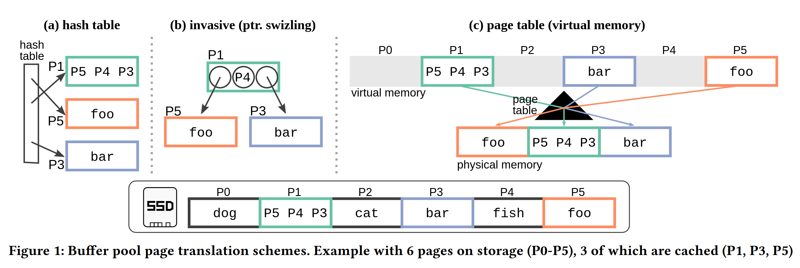
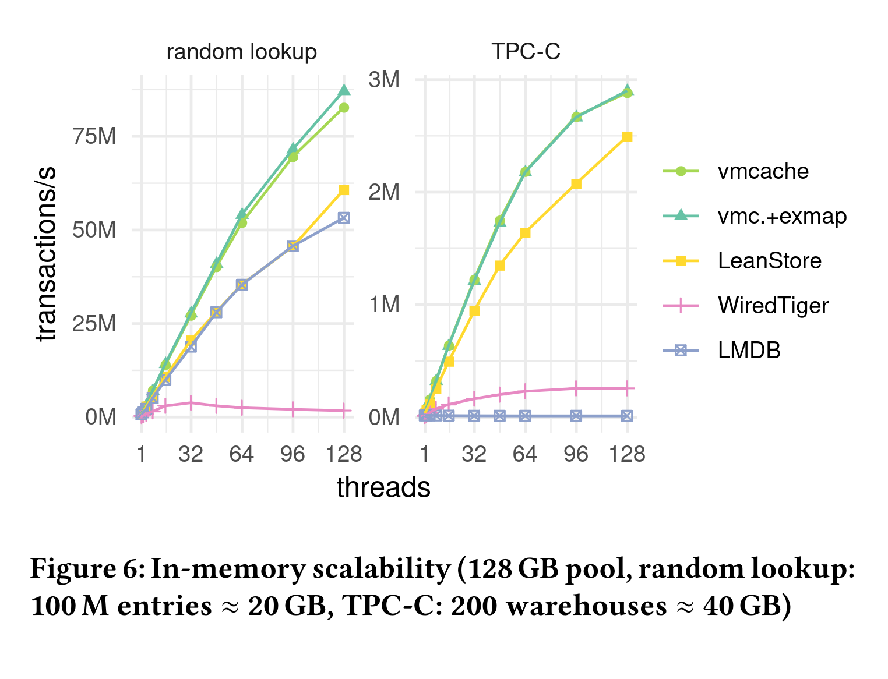
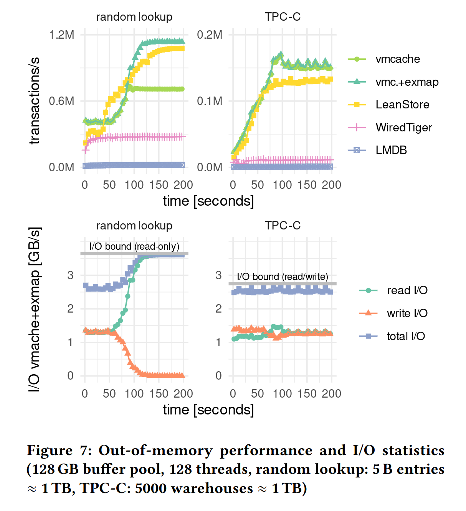

In the [first]() and [second]() part of this little two series about modern database storage we have already learned about the history of of our series about modern database storage we have already learned about the history of database storage technology and about pointer swizzling as a first modern buffer management technique. I have also described some of the drawbacks of pointer swizzling, mainly that it leaks into your entire system because you cannot have a nice clean buffer manager API with loose coupling that just dereferences page ids to pointers.

In this part we will be presenting another and newer technique called VMCache and compare the approaches

# VMCache: Using virtual memory (the correct way)

Haven't we already said that mmap is bad in the last part? Well yes but also no. What we have said is that using mmap to map a file to memory and let the OS manage everything is bad. We can, however, also use anonymous MMAP which just maps a memory region to the immutable zero-page and copies it on the first write. Luckily there is also madvise with the MADV_DONTNEED flag that allows us to unmap a subregion in an mmaped memory region and release its memory. 

Prof. Leis (TUM) introduced a new buffer manager called VMCache (["Virtual-Memory Assisted Buffer Management"](https://www.cs.cit.tum.de/fileadmin/w00cfj/dis/_my_direct_uploads/vmcache.pdf)) at SIGMOD 2023, which relies on exactly those techniques. What you do is to just map your entire database to a large anonymous memory region and then manage eviction manually using madvise. The big benefit this has is that you have a normal buffer manager API again which just maps page ids to pointers while still getting the hardware acceleration of virtual memory. In this case, this happens through a single add instruction (super cheap) and a check in a separate state array (you could also implement it to be on the page itself) to see whether it is actually present or just pointing to the zero page. Since this state is the page latch at the same time, there is basically no overhead for this check over pure in-memory. Also, because the load of the page state has no data dependency on the the page itself, the CPU will most likely execute both in parallel therefore hiding the cache miss latency.


*Illustration of the page state array from Leis et al.: "Virtual-Memory Assisted Buffer Management"*

This makes the in-memory case slightly slower than for pointer swizzling because you are doing a bit more work. This difference will usually not be significant. The benefits of using this strategy over pointer swizzling are that it is much easier to implement and has a lot fewer footguns. 

The pseudocode for this is pretty simple:

```c++
Page* fix_page(uint64_t page_id) {
    Page* page = virt_mem[page_id];
    if(page_state[page_id] != EVICTED) {
        return page;
    } else {
        evict_pages();
        load_from_disk(page_id, page);
        return page;
    }
}
```

In this case `evict_pages()` doesn't return an empty buffer frame like in the other approaches since we have to load our page to the predetermined virtua memory address. Instead eviction just makes sure that we use less physical memory than we are allowed to use.


*Illustration from Leis et al.: "Virtual-Memory Assisted Buffer Management"*

The problem with this strategy is that madvise with MADV_DONTNEED is not cheap. Especially in the multithreaded case you can run into contention inside the kernel if you use it too much and every MADV_DONTNEED will shoot down the Translation Lookaside Buffer (TLB). The original paper shows that for TPC-C, which aims to simulate a normal transactional (OLTP) business use case, this is not really relevant (10x out of memory), at least as long as you are using only a single SSD (even if its one of those fast ones mentioned earlier). TPC-C is quite skewed so there will be a lot fewer evictions than there could be. In the exteme case of random reads the problem is significant as even with a single fast SSD it will lead to half of the possible performance and this could become arbitrarily worse with more or faster SSDs. 

What the paper proposes to minimize the TLB shootdowns is to evict pages in batches of something like 64. The solution for the kernel contention proposed in the paper is a Linux kernel module called exmap that allows this kind of manual management of virtual memory but with optimized operations in kernel space that don't have the same kind of contention as the vanilla Linux case. The problem is that kernel modules are kind of nasty from an operational perspective. They completely destroy the "plug and play" experience you get with docker containers and you might need new versions of the module for new kernel versions.

Another problem is of course that the Linux page table of an MMAPed region will only be freed when the entire region is unmapped. This means that for use cases where data is much larger than main memory a significant of amount of that main memory will be taken up by the page table. Compaction of the page table has been a topic in the Linux kernel mailing list but it hasn't been implemented yet. One can do the math on this and see that, assuming we put the page state onto the page itself to not have an 8 byte state for every page in-memory, the page table will take up roughly 1/512th of the full dataset size. This means that while for a 20x out of memory case (like 1TB of data on 50GB of RAM) the page table will take up only 4% of our memory size, for a 50x out of memory case (like 10TB of data on 200GB of RAM) it will already take 10% and for a 100x case it will already take 20%. If you store the page state in a separate array like the paper proposes you can even double those numbers. This also means that 50-100x out of memory is the maximum that is feasible without wasting something like half of your memory on the page table. This is probably ok since at 100x out of memory you would be paying twice as much for your SSDs than for your RAM and since you have a normal buffer manager interface you could also have an alternative traditional buffer manager for this edge case and swap that in if you really it.

# Evaluation

The VMCache Paper also evaluates the performance of VMCache against LeanStore,  WiredTiger (both use some form of pointer-swizzling) and LMDB which famously uses MMAP. This uses a somewhat beefy machine with an AMD EPYC 7713 processor (64 cores, 128 hardware threads) and 512 GB main memory.


*Plot from Leis et al.: "Virtual-Memory Assisted Buffer Management"*

As you can see VMCache is in the same ballpark as LeanStore which confirms the in-memory performance. Don't overinterpret the fact that it performs better in both benchmarks since LeanStore is a much more mature system and a full storage engine and not just a prototype like the [VMCache implementation](https://github.com/viktorleis/vmcache).

As you can see, LMDB does ok in the read only case but completely falls apart as soon as you start writing, even in the pure in-memory case (TPC-C has a lot of writes).

When looking at the out-of-memory benchmarks we can now see in the random read benchmark why exmap is necessary :


*Plot from Leis et al.: "Virtual-Memory Assisted Buffer Management"*

What we can also see here is that WiredTiger was still designed mostly as a disk based engine. The difference between it and VMCache/LeanStore is much smaller than in the in-memory case. 

LMDBs performance on the other hand, like in the in-memory TPC-C case, is indistinguishable from a flat line at 0. Note that the benchmarks were most likely run with default config. Apparently the out-of-memory read performance of LMDB can be improved by setting the MDB_NORDAHEAD flag. This flag disables prefetching of the following pages on page faults. What I don't understand is why this is not the default setting.

# Conclusion

To conclude, there is not any approach yet that is simple to implement, not intrusive like pointer swizzling and perfectly performant for both in- and out of memory workloads but we are slowly getting there in research. If the Linux Kernel actually included something like the exmap Kernel module from the VMCache paper into the mainline Kernel then i would believe that VMCache would be an almost perfect solution for all practical purposes. Until then you either have to install the exmap kernel module, be ok with bad out-of-memory scalability  or find other ways around it.

What this post also shows is that there is still a lot of opportunity for further research. However what i hope you have also learned from reading this is that with modern buffer managers you can actually kind of eat your cake and have it too. The old dichotomy of in-memory vs disk based was kind of a false one. We can combine them into one very performant system. Especially Umbra shows this very well. It is easily able to compete against pure in-memory systems like its pure in-memory predecessor HyPer. Similarly to techniques like code generation for query execution comes at the cost of system complexity though. Bringing this complexity down is a big task for academia and industry and should get more focus in research.